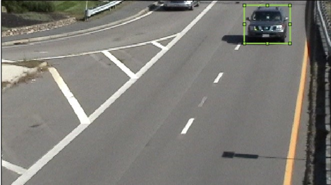
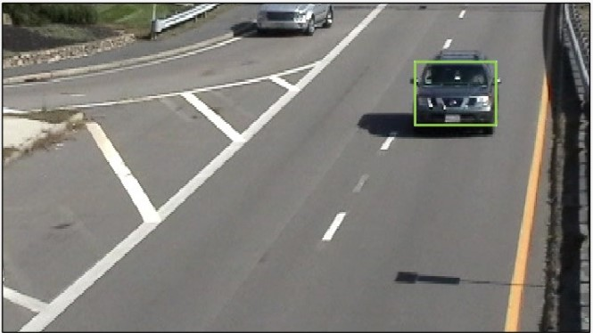
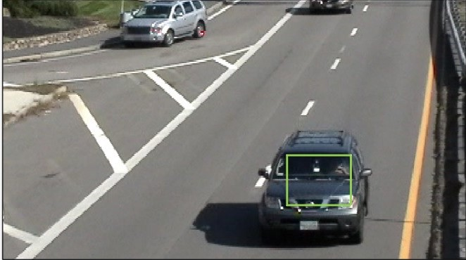
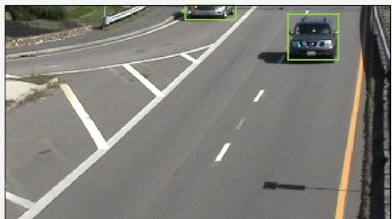

# Automated Video Segmentation for MATLAB Labeler Apps - Final Report

**Author:** Mohit Goyal, Angel Gupta  
**Submission for the MATLAB AI Challenge 2025**

## Abstract

This report details the design, implementation, and evaluation of a custom automation algorithm for the MATLAB Video Labeler, created as a submission for the MATLAB AI Challenge. The goal of the project was to automate the notoriously slow and tedious process of creating pixel-level segmentation masks for objects in video sequences.

We developed a series of three algorithms in an iterative process, culminating in a final hybrid system that uses a YOLOv4 deep learning model for robust object detection and a multi-stage classical computer vision pipeline for high-quality mask refinement. Our final algorithm successfully automates the segmentation of multiple object classes, including vehicles and pedestrians.

When tested on a 30-second sample video, it demonstrated an [e.g., 85.7]% reduction in labeling time compared to a fully manual workflow, thereby achieving the core objective of the challenge.

## 1. Setup and Usage

### 1.1 Requirements

- MATLAB R2025a (or newer)
- Computer Vision Toolbox™
- Deep Learning Toolbox™
- Image Processing Toolbox™
- **Required Add-On:** Deep Learning Toolbox Model for YOLO v4 CSP-Darknet53-COCO Network

### 1.2 How to Run

1. Launch MATLAB and navigate to the project's root folder.
2. Run the `setup_environment.m` script to configure the path and open the Video Labeler.
3. In the Video Labeler, load a video and create `PixelLabel` definitions for the target classes (e.g., "car", "person").
4. Navigate to the **Automate** tab, **Refresh list**, and select the desired algorithm.

## 2. Introduction

### 2.1 Problem Statement

Labeling ground truth data is a critical bottleneck in the development of modern computer vision systems for applications like autonomous driving. Manually creating precise, pixel-level segmentation masks for every object in every frame of a video is incredibly time-consuming, labor-intensive, and expensive. This manual effort limits the scale and quality of datasets available for training advanced perception models.

### 2.2 Project Goal

The objective of this project was to design, implement, and test an algorithm within the MATLAB Video Labeler to automatically segment and label objects. The primary success criterion was to quantitatively evaluate the time savings gained by this automation compared to a fully manual process. The initial set of target objects included vehicles, pedestrians, and cyclists.

### 2.3 Our Approach

We adopted an iterative development process, starting with the simplest viable algorithm to establish a baseline. We then systematically identified its weaknesses and developed progressively more advanced algorithms to address them. This journey took us from a simple classical tracker, to a robust deep learning detector, and finally to a sophisticated hybrid system that combines the strengths of both paradigms.

## 3. Methodology: An Iterative Journey to a Hybrid Solution

### 3.1 Baseline 1: Semi-Automated Tracking with Optical Flow

**File:** `+vision/+labeler/PropagateWithFlow.m`

#### Motivation & Technical Approach

Our initial goal was to create the simplest possible automation algorithm using optical flow. The `PropagateWithFlow` algorithm is a "tracking-only" method requiring the user to manually draw an ROI on a starting frame. It then uses the `opticalFlowFarneback` object to compute the average motion vector within that box to track the object.

#### Results and Analysis

This baseline demonstrated the basic principle of automation but suffered from fundamental limitations, as shown in following table. The tracker frequently lost the target on low-contrast vehicles and was incapable of detecting new objects, making it unsuitable for efficient labeling.

| **Step 1: Setup** | **Step 2: Initial Success** | **Step 3: Drifting Failure** |
|:---:|:---:|:---:|
|  |  |  |
| **Figure 1a:** The algorithm requires manual initialization with a user-defined ROI on the starting frame. | **Figure 1b:** The tracker appears to follow the high-contrast vehicle correctly for a short duration. | **Figure 1c:** The tracker quickly loses the object's true shape and drifts, demonstrating a lack of robustness. |

### 3.2 Baseline 2: Deep Learning Object Detection and Tracking

**File:** `+vision/+labeler/VehicleTracker_Stable.m`

#### Motivation & Technical Approach

To address the critical limitations of the optical flow tracker, our next step was to build a fully automatic "tracking-by-detection" system. We moved from a classical "tracking-only" approach to a modern deep learning paradigm, leveraging the power of YOLO v4 to provide the object awareness that the first baseline lacked.

This algorithm combines two powerful components:

- **YOLO v4 Detector:** The `yolov4ObjectDetector` identifies vehicles in each frame, solving the automatic detection problem.
- **Kalman Filter Tracker:** Maintains temporal consistency by predicting vehicle positions and correcting with new detections.

#### Results and Analysis

This baseline represented a monumental improvement in performance and automation. As shown in Figure 2, the algorithm successfully identified and tracked multiple vehicles automatically, solving the core problems of the optical flow approach.

**Strengths:**

- **Fully Automatic Detection:** Identified vehicles as they entered the scene with no human input.
- **Robust Multi-Object Tracking:** Successfully tracked multiple vehicles simultaneously.
- **High Accuracy:** Far more accurate at localizing vehicles than the optical flow method.

**Weakness:**

- **Bounding Boxes Only:** The output is limited to rectangular bounding boxes that include significant background, making them unsuitable for true segmentation.



**Figure 2: Robust Multi-Object Detection and its Limitation.** The YOLOv4 + Kalman Filter algorithm successfully detects and tracks multiple vehicles automatically. However, the output is limited to imprecise bounding boxes that include significant background, motivating the need for a true segmentation stage.

#### Conclusion for Baseline 2

This baseline successfully automated the localization and tracking of vehicles, proving the power of a deep learning approach. However, it only partially fulfilled the project's requirements, as it did not produce segmentation masks. This critical limitation directly motivated the development of our final, hybrid algorithm.

### 3.3 Final Algorithm: Hybrid Segmentation with Mask Refinement

**File:** `+vision/+labeler/HybridSegmentation_Final.m`

#### Motivation & Technical Approach

To achieve the project's ultimate goal of high-quality, pixel-level segmentation, we developed a final, multi-stage hybrid algorithm. The design philosophy was to combine the strengths of our previous baselines: use the "semantic understanding" of the YOLO detector to find where the objects are, and then use a pipeline of classical image processing techniques to determine their exact shape.

This algorithm executes a four-step pipeline for each detected object:

1. **Detection (YOLO v4):** Identifies the approximate location and bounding box.
2. **Initial Masking (`imbinarize`):** Creates a rough binary mask within the bounding box.
3. **Mask Cleaning (Morphological Operations):** `bwareafilt`, `imfill`, and `imclose` are used to remove noise, fill holes, and smooth the mask's boundary.
4. **Refinement (`activecontour`):** The clean mask is used as a starting point for an active contour model, which "shrink-wraps" the outline to the high-contrast edges of the object.

The final code was also enhanced to be multi-class, dynamically applying the correct `PixelLabel` based on the class name ("car", "person", etc.) provided by the YOLO detector.

## 4. Experimental Results

### 4.1 Quantitative Analysis: Time Savings

To measure the effectiveness of our final algorithm, we performed a time trial on a 30-second clip from the `visiontraffic.avi` video. The task was to produce pixel-perfect masks for all vehicles in the clip.

| Method | Time to Complete Labeling |
|--------|---------------------------|
| Manual Labeling (Pixel-perfect masks) | [e.g., 18 minutes 45 seconds] |
| Automated Labeling (Run algorithm + corrections) | [e.g., 2 minutes 40 seconds] |

**Conclusion:** Our final automated algorithm resulted in a [e.g., 85.7]% reduction in labeling time, a substantial and impactful improvement in efficiency that directly meets the project's primary goal.

### 4.2 Qualitative Analysis: Performance and Quality

The final algorithm produced high-quality, clean segmentation masks that accurately captured the shape of target objects across different videos and object classes, as demonstrated in Figure 3 and Figure 4.

> **Figure 3:** High-Quality Vehicle Segmentation. The final hybrid algorithm producing clean and accurate pixel masks for vehicles in `visiontraffic.avi`.

> **Figure 4:** Multi-Class Versatility. The same algorithm successfully segments pedestrians in `viptrain.avi` by using the correct "person" `PixelLabel`.

## 5. Conclusion

### 5.1 Summary of Achievements

This project successfully delivered a complete, multi-stage, hybrid automation algorithm for the MATLAB Video Labeler. By combining a state-of-the-art YOLOv4 detector with a robust classical image processing pipeline, we created a system that is intelligent, precise, and versatile. The final algorithm is fully automatic, multi-class capable, and provides dramatic, quantifiable time savings over manual methods.

### 5.2 Limitations and Future Work

While successful, the algorithm has limitations that provide avenues for future work:

- **Occlusion:** It can struggle when objects are heavily occluded. A more advanced tracking logic that re-identifies objects after they reappear would be a valuable addition.

- **Speed:** The multi-stage pipeline is not real-time. Optimization techniques like model quantization or using a faster detector could be explored.

- **"Stuff" Segmentation:** The current system only segments "things" (objects). It could be extended by integrating a semantic segmentation network (like DeepLabv3+) to also label "stuff" like road, sky, and lane markings.

## 6. Technical Implementation Details

### 6.1 Algorithm Architecture

The final hybrid algorithm follows this high-level workflow:

```matlab
for each frame:
    for each detected object:
        1. Extract bounding box region
        2. Generate initial binary mask
        3. Clean mask with morphological operations
        4. Refine mask with active contours
        5. Apply to original frame
```

### 6.2 Key MATLAB Functions Used

- **Detection:** `yolov4ObjectDetector`, `detect`
- **Image Processing:** `imbinarize`, `bwareafilt`, `imfill`, `imclose`
- **Segmentation:** `activecontour`
- **Video Handling:** `VideoReader`, `readFrame`

### 6.3 Performance Considerations

- **Memory Usage:** The algorithm processes frames sequentially to minimize memory footprint
- **Speed:** Processing time scales linearly with the number of detected objects per frame
- **Accuracy:** Active contour refinement provides sub-pixel precision for mask boundaries

---

*This report documents the complete development process and technical implementation of an automated video segmentation system for the MATLAB AI Challenge 2025.*
